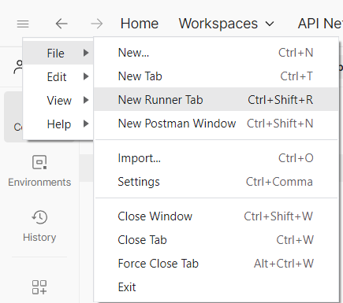
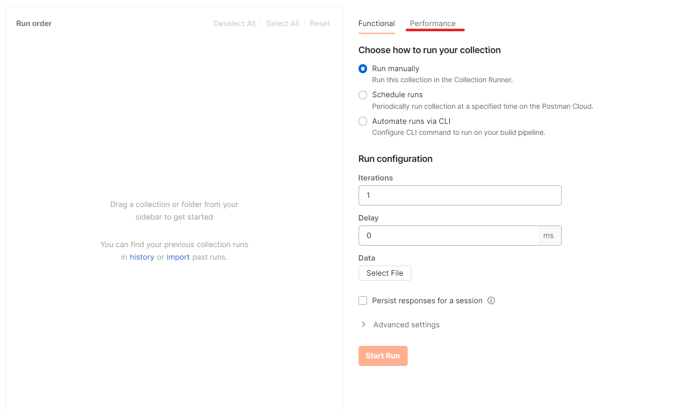
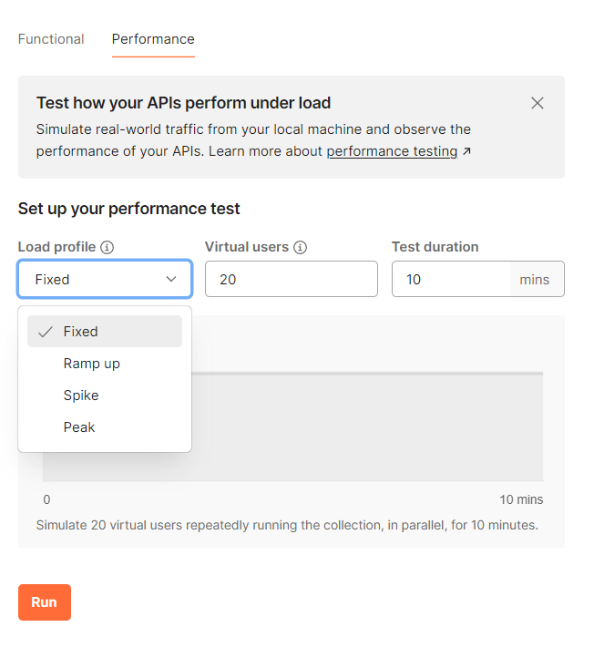

# Aufgaben

## 3
### Running Stress-Tests via Postman

#### Open a new Runner Window

On the top left, open the menu by clicking on the burger icon. Then click on File to expand yet another menu, in which you can select "New Runner Tab" to begin testing your tests.

#### Switching to Performance

Now switch to Performance. You also have to *drag and drop* some Request into the field on the left.

#### Selecting the Performance Profile and testing Performance

Here you can select how Postman will perform the Performance Test. You can select the Amount of Users ("Threads"), the duration of the Performance Test, and the "Load Profile". This will determine how the Requests should act during the Test duration.

